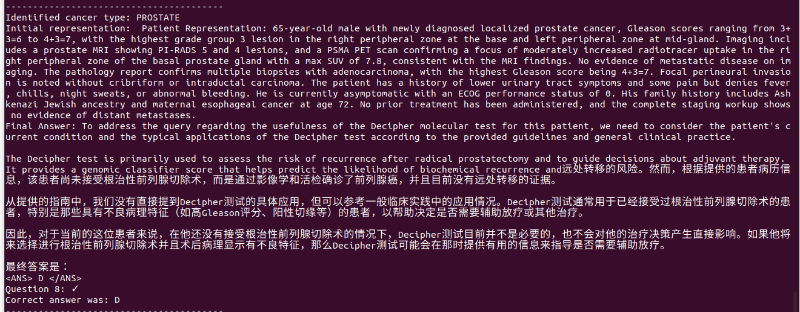
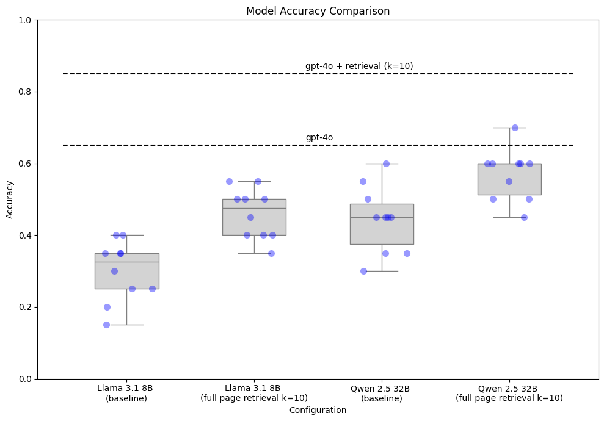
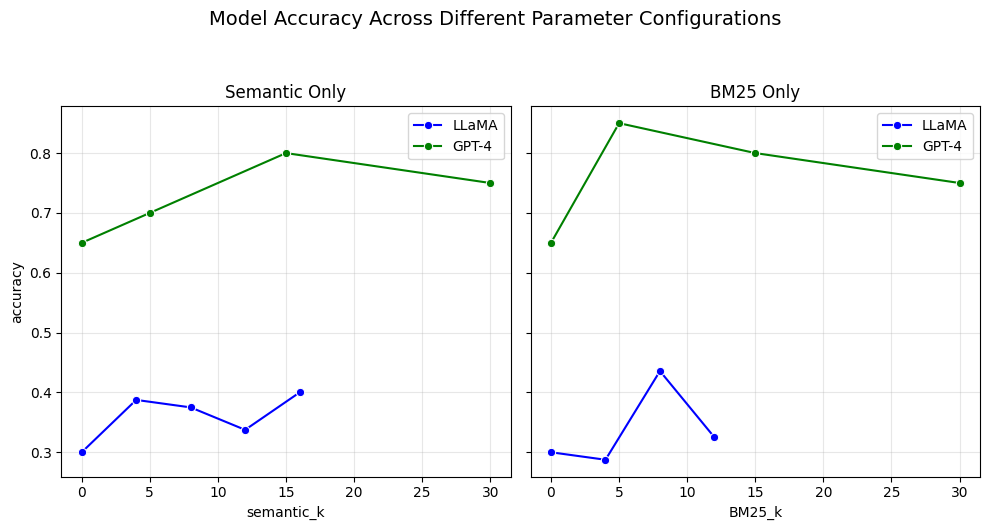

# We'll see who automates who
*Reflections on trying to write a language model program that can practice oncology*

I started this project (to write an AI program capable of providing guideline-grounded clinical management in oncology) mostly as sort of a joke. As a radiology resident, for as long as I've been training, a constant refrain I’ve heard from doctors in other specialties is that I’ll be automated away by AI. Whether or not that’s true, I thought it would be funny to turn the tables and work on a project trying to automate someone else for a change. During an elective rotation in hematology/oncology, I spent a month in clinic seeing cancer patients along with oncologists, and got to take a look at society practice guidelines, like [those published by the NCCN](https://www.nccn.org/guidelines/category_1). And I thought to myself, why couldn’t gpt-4o plus the flowcharts in these guidelines do the same job an oncologist does? (Kidding, mostly. [There’s always going to be the human element of the job](https://stanmed.stanford.edu/surprising-chatgpt-revelation/)). 


All joking aside, I thought this project would give me a chance to practice writing programs with language models, to think about building medical evals, and to give my GPUs something to churn on. My write-up here exists somewhere on the spectrum between technical report/blog post/and personal essay. The project is far from being done, but since I’m working on it solo during a year when I’m mostly really busy with other clinical activities, I thought I’d write up some of my progress in case I don’t get any further on it. Maybe it’s sort of an invitation for collaborators. Also possibly kind of a bad lab notebook. Mostly, though, it’s kind of a public-facing journal entry for me to look back at in the future to remember what it was like trying to do research during intern year.

**TLDR:**
Large models like gpt4o do really well on a set of clinically meaningful oncology questions right out of the box. Giving models access to guidelines improves their performance, and this is consistent across three different model sizes (an 8B unquantized model, a 32B 4-bit quantized model, and gpt-4o). Building good medical evals for models is really hard. Engineering programs and prompts with language models is a huge pain in the ass. 


## Building an eval 

The first step was trying to more rigorously define what I was trying to build, and how I was going to measure progress towards that goal. I wanted to create a program that would, given some information from a cancer patient’s chart, accurately answer questions about optimal management of that patient per NCCN guidelines. So to measure my progress, I needed an eval with cancer patient charts, questions, and a way to automatically evaluate a model/program’s answers. 

I started by creating 5 fake heme/onc patient files. Each patient file had some subjective information (e.g. patient’s symptoms, goals of care and values that might be relevant to treatment) and a lot of objective information, including radiology and pathology reports, lab values, genetic testing, and physical exam findings.  I tried to make these as realistic as possible based on what I had seen and read in clinic over the month, but with made up data to avoid patient privacy issues. Here's an example of one of my made-up charts:

```
History of Present Illness:
March 2023 PSA 5.35, repeat April 2024 5.34.  Patient was referred to Urology clinic, no palpable masses on DRE.  
June 2023 prostate MR:  27mL gland, PI-RADS 5 at base R peripheral zone and PI-RADS 4 at the L peripheral zone mid gland, no ECE, no seminal vesicle abnormality or adenopathy.  
July 2023 prostate biopsy: R peripheral zone at base-Gleason 4+3=7 and Gleason 3+4=7. L peripheral zone at mid gland Gleason 4+3=7 and 4+3=7 and 4+3=7. R base-Gleason 3+3=6. R base lateral-3+3=6. R mid-Gleason 3+3=6. L base-Gleason 3+4=7. L base lateral-3+4=7. L mid-3+4=7. L mid lateral-3+4=7. L apex-3+3=6.  Focal perineural invasion with no cribriform or intraductal carcinoma identified.

Patient has no new symptoms in the interval since his last visit. Still is having lower urinary tract symptoms and some pain.  Denies fevers chills or night sweats.  Appetite is normal and weight has been stable to increasing.  He denies any abnormal bleeding. He denies chest pain, DOE, or LE edema  

ECOG: 0

Family History:
- Has Ashkenazi jewish ancestry.
- mother w/ esophageal cancer @ age 72 

Imaging:
August 2023 PSMA PET:
PROSTATE/PROSTATE BED:
-Focus of moderately increased radiotracer uptake in the right peripheral zone of the basal prostate gland (axial fused image 155) with a max SUV of 7.7, which corresponds to abnormal signal seen on the prior MRI.
-No significant findings on the non-contrast CT localizer images.
LYMPH NODES:
-No significant abnormal uptake. 
-No pathologically enlarged or any suspect lymph nodes demonstrated on noncontrast CT images.
BONES: 
-No abnormal uptake that would suggest tumor involvement. 
-No concerning lytic or sclerotic osseous lesions.
Additional nonphysiologic sites of tracer uptake:
-None.
Additional CT findings at the sites below:
HEAD/NECK:
-None.
CHEST: 
-No significant abnormalities in the lungs.
-Note: CT images of the lungs during a PET/CT exam are obtained during quiet respiration. Therefore, small nodules or other small focal pulmonary abnormalities may not be adequately imaged and/or may be obscured by atelectasis and/or motion artifact.
ABDOMEN/PELVIS: 
-Ventral hernia.
OTHER/MISCELLANEOUS:
-None.
IMPRESSION:
Focus of moderately increased radiotracer uptake in the right peripheral zone of the basal prostate gland, which corresponds to abnormal signal seen on the prior MRI. Findings compatible with prostate cancer.
No evidence of metastases.


Pathology: 
July 2023 Prostate bx:
2.	PROSTATE, RIGHT PERIPHERAL ZONE AT BASE, LESION #1, CORE NEEDLE BIOPSY:
	A.	Adenocarcinoma of the prostate.
		i.	Gleason score:  4+3 = 7 out of 10.
		ii.	Grade group 3.
	B.	Percentage of Gleason pattern 4:  60%.
	C.	The linear measurement of tumor is 2 mm (12% of submitted tissue)
3.	PROSTATE, RIGHT PERIPHERAL ZONE AT BASE, LESION #1, CORE NEEDLE BIOPSY:
	A.	Adenocarcinoma of the prostate.
		i.	Gleason score:  3+4 = 7 out of 10.
		ii.	Grade group 2.
	B.	Percentage of Gleason pattern 4:  30%.
	C.	The linear measurement of tumor is 3 mm (approximately 30% of submitted tissue).

... many more cores omitted here ...

17.	PROSTATE, LEFT APEX, CORE NEEDLE BIOPSY:
	A.	Adenocarcinoma of the prostate.
		i.	Gleason score:  3+3 = 6 out of 10.
		ii.	Grade group 1.
	B.	The linear measurement of tumor is less than 0.5 (less than 5% of submitted tissue).
1, 10-12,18.	PROSTATE, SITES AS DESIGNATED BELOW, CORE NEEDLE BIOPSIES:
			Benign prostatic glands and stroma.
Focal perineural invasion is identified.
There is no cribriform growth pattern.
No intraductal carcinoma is identified.
```


After putting together the fake charts, I then generated ~ four questions about optimal management for each patient. This included obvious questions like, “What treatment would be best for the patient?”, and perhaps less obvious questions like “The patient heard about this commercial genetic test that claims to help with risk stratification. Would it be appropriate for him?” In order to make the test automatically evaluable, I generated a set of multiple choice answers and distractors for each question. So my “end product” was a jsonl file, where each line contained a link to one of my fake patient charts, a question, an ideal answer, and 3 to 10 “distractor answers.” I designed the wrong answers to be as hard as possible by looking at the guidelines and picking options that might require looking up info on different pages to differentiate, and that would require nuanced understanding of the patient’s characteristics to differentiate. I also followed [chembench](https://arxiv.org/abs/2404.01475) and [lab-bench](https://arxiv.org/abs/2407.10362) in using free-text automatic multiple choice parsing to evaluate open models and closed API models on the same evals.

My eval questions:
```
{"context": "01_textdata.txt", "question": "What is the next step in management for this patient?", "ideal": "Biopsy confirmation from a possible metastatic site", "distractors": ["FOLFIRINOX", "modified FOLFIRINOX", "Entrectinib", "Laparoscopy", "Testing for potentially actionable somatic findings"]}
{"context": "01_textdata.txt", "question": "Biopsies of several possible metastatic sites were completed, and all were negative. What is the next best step in management for this patient?", "ideal": "Staging laparoscopy", "distractors": ["FOLFIRINOX", "Measure a CA 19-9 level", "modified FOLFIRINOX", "Entrectinib", "Testing for potentially actionable somatic findings"]}
{"context": "01_textdata.txt", "question": "Biopsies of several possible metastatic sites were completed, and all were negative. Staging laparoscopy confirms the absence of metastatic disease. Patient also is known to have a BRCA2 mutation. Which of the following would be an appropriate next step?", "ideal": "Gemcitabine and cisplatin, then subsequently, chemoradiation", "distractors": ["Gemcitabine + capecitabine", "Gemcitabine followed by chemoradiation, with subsequent gemcitabine", "Bolus 5-FU + leucovorin followed by chemoradiation, with subsequent bolus 5-FU + leucovorin", "Surgical resection"]}
{"context": "01_textdata.txt", "question": "Biopsies of several possible metastatic sites were completed, and all were negative. Staging laparoscopy confirms the absence of metastatic disease. Which of the following would be an appropriate next step?", "ideal": "FOLFIRINOX, then subsequently, chemoradiation", "distractors": ["Gemcitabine + cisplatin then subsequent chemoradiation", "Gemcitabine followed by chemoradiation, with subsequent gemcitabine", "Bolus 5-FU + leucovorin followed by chemoradiation, with subsequent bolus 5-FU + leucovorin", "Surgical resection"]}
{"context": "02_textdata.txt", "question": "How would you risk stratify this patient?", "ideal": "Unfavorable intermediate", "distractors": ["Favorable intermediate", "Very low", "Low", "High", "Very high"]}
{"context": "02_textdata.txt", "question": "Prior to diagnosis, actuarial models would have predicted that this patient had an expected survival of 15 years. Which of the following therapy choices would be most appropriate?", "ideal": "Radical prostatectomy plus peripheral lymph node dissection.", "distractors": ["Radical prostatectomy", "Radiation therapy + ADT", "Radiation therapy alone", "ADT alone", "Observation alone", "Radical prostatectomy plus ADT"]}
{"context": "02_textdata.txt", "question": "What additional diagnostic would be most appropriate at this time?", "ideal": "Germline genetic testing for MLH1, MSH2, MSH6, PMS2, BRCA1, BRCA2, ATM, PALB2, and CHEK2", "distractors": ["Somatic tumor genetic testing for MLH1, MSH2, MSH6, PMS2, BRCA1, BRCA2, ATM, PALB2, and CHEK2", "Germline genetic testing for MLH1, MSH2, MSH6, PMS2", "Germline genetic testing for BRCA1, BRCA2, ATM, PALB2, and CHEK2", "Somatic tumor genetic testing for MLH1, MSH2, MSH6, PMS2", "Somatic tumor genetic testing for BRCA1, BRCA2, ATM, PALB2, and CHEK2", "Tumor mutational burden testing", "Decipher molecular assay", "Androgen receptor splice variant 7 (AR-V7) testing in circulating tumor cells"]}
{"context": "02_textdata.txt", "question": "The patient would like to know if the Decipher molecular test will be helpful for him at this time. How do you respond?", "ideal": "Decipher could be helpful down the line if you had a radical prostatectomy and adverse features were found. Then it would help to decide whether or not you would benefit from EBRT.", "distractors": ["Decipher could be helpful down the line if you had a radical prostatectomy. Then it would help to decide whether or not you would benefit from adjuvant chemotherapy.", "Decipher would be helpful in deciding whether to pursue radical prostatectomy vs radiation therapy.", "Decipher would be helpful in deciding whether to pursue chemotherapy vs radiation therapy.", "Decipher would not be helpful in a patient with your risk profile.", "Decipher would not be helpful in a patient with your life-expectancy."]}
{"context": "02_textdata.txt", "question": "The patient would like to know how frequently he'll continue to undergo monitoring after he does his appropriate initial therapy. Which proposed monitoring regimen here would be most appropriate?", "ideal": "PSA every 6 months for five years, then yearly PSA. Digital rectal exams only if suspicion of recurrence.", "distractors": ["PSA and digital rectal exams every year.", "PSA and physical exam every six months, and add on imaging for symptoms or increasing PSA.", "Yearly PET scan for five years, then follow PSA alone.", "PSA every 3 months for two years, then yearly PSA. Digital rectal exam every 6 months.", "No monitoring would be required in this patient following appropriate initial therapy."]}
{"context": "02_textdata.txt", "question": "Prior to diagnosis, actuarial models would have predicted that this patient had an expected survival of 6 years. Which of the following therapy choices would be most appropriate", "ideal": "Radiation therapy + ADT", "distractors": ["Radical prostatectomy", "Radical prostatectomy plus peripheral lymph node dissection.", "Radiation therapy alone", "ADT alone", "Observation alone", "Radical prostatectomy plus ADT"]}
{"context": "03_textdata.txt", "question": "How would you risk stratify this patient?", "ideal": "High", "distractors": ["Favorable intermediate", "Very low", "Low", "Unfavorable intermediate", "Very high"]}
{"context": "03_textdata.txt", "question": "Prior to diagnosis, actuarial models would have predicted that this patient had an expected survival of 7 years. Which of the following therapy choices would be most appropriate?", "ideal": "Radical prostatectomy plus peripheral lymph node dissection.", "distractors": ["Radical prostatectomy", "Radiation therapy + ADT", "Radiation therapy alone", "ADT alone", "Observation alone", "Radical prostatectomy plus ADT", "Radiation therapy + ADT + abiraterone", "Either radical prostatectomy plus peripheral lymph node dissection OR Radiation therapy + ADT would be equally good choices"]}
{"context": "03_textdata.txt", "question": "The patient underwent radical prostatectomy plus lymph node dissection. There were no positive nodes, but the resection had positive margin, seminal vesicle invasion, and extracapsular extension. What is the most appropriate next step?", "ideal": "EBRT and ADT", "distractors": ["Monitoring with consideration of early RT for a detectable and rising PSA or PSA >0.1 ng/mL", "ADT", "ADT plus abiraterone", "Darolutamide", "Cisplatin/etoposide"]}
{"context": "03_textdata.txt", "question": "The patient underwent radical prostatectomy plus lymph node dissection. There were no positive nodes, and the resection demonstrated evidence of extracapsular extension, but no seminal vesicle invasion or positive margins. What is the most appropriate next step?", "ideal": "Monitoring with consideration of early RT for a detectable and rising PSA or PSA >0.1 ng/mL", "distractors": ["EBRT and ADT", "ADT", "ADT plus abiraterone", "Darolutamide", "Cisplatin/etoposide"]}
{"context": "04_textdata.txt", "question": "Which treatment would be the best choice for this patient?", "ideal": "ADT + Abiraterone + docetaxel", "distractors": ["ADT + Apalutamide", "ADT with EBRT to the primary tumor", "ADT with EBRT to the primary tumor plus docetaxel", "Radical prostatectomy plus peripheral lymph node dissection", "Radiation therapy alone"]}
{"context": "04_textdata.txt", "question": "Which of the following is the best description of the patient's metastatic disease?", "ideal": "High-volume synchronous metastases", "distractors": ["High-volume metachronous metastases", "Low-volume synchronous metastases", "Low-volume metachronous metastases"]}
{"context": "05_textdata.txt", "question": "Which of the following is the best description of the patient's cancer?", "ideal": "Clinical stage IIA", "distractors": ["Clinical stage I", "Clinical stage IIB", "Clinical stage III"]}
{"context": "05_textdata.txt", "question": "Would the use of Oncotype Dx provide useful clinical guidance for this patient?", "ideal": "It only will if it can be further clarified that the patient is HER-2/neu negative", "distractors": ["It only will if it can be further clarified that the patient is HER-2/neu positive", "It will be useful due to the patient's equivocal HER-2/neu status", "It would be useful regardless of the patient's HER-2/neu status"]}
{"context": "05_textdata.txt", "question": "Would any additional imaging be appropriate for the patient at this time?", "ideal": "Yes, breast MRI.", "distractors": ["Yes, additional mammography", "No, the patient has been sufficiently imaged already.", "Yes, PET-CT."]}
{"context": "05_textdata.txt", "question": "The patient continued to not have periods despite stopping oral contraceptive pills. Further workup also determines that her tumor is HER2-negative, and she her nodal status is pN0. An Oncotype Dx is ordered, and has a score of 30. What recommendations would you make for adjuvant therapy?", "ideal": "Both chemotherapy and endocrine therapy.", "distractors": ["Endocrine therapy alone", "Chemotherapy alone.", "No adjuvant therapy is required."]}
```


A few scattered reflections on the process of building this benchmark: 


1) I think my dual medical and CS training often feels like a waste of time, or at least a very inefficient use of it. But the ability to put together a clinical benchmark for my own language model program really made me feel like I was using both halves of my brain, so to speak. It probably would be more efficient (and accurate) if I worked on this project with a heme-onc fellow or something, but I needed the rare win for physician-scientist joint training. 


2) A lot of people have written about desiderata for good evals: including [Jason Wei from OpenAI](https://www.jasonwei.net/blog/evals) and [Ofir Press at Princeton](https://ofir.io/How-to-Build-Good-Language-Modeling-Benchmarks/). Ofir, and others, have argued that multiple choice benchmarks aren’t a very realistic eval because real-world tasks aren’t formulated as multiple choice questions. I’d argue that this is a claim that could be empirically tested, and this would be one of the first things I’d want to do to extend this project if I kept working on it. Specifically, the question I’d want to test was whether a well-designed multiple choice eval could produce scores that correlate well with physician grades of the utility of open-ended generations. My (untested, unverified) feeling is that multiple choice benchmarks (if well-designed) DO have good validity, and this is why we decided to use these [when we built lab-bench](https://arxiv.org/abs/2407.10362). Anyway, my point being that I think the potential utility of multiple choice evals is still an open question and isn’t as clear cut as some people would make it seem. 


3) [Qwen 2.5 32B](https://huggingface.co/Qwen/Qwen2.5-32B-Instruct) serves as an amusing counterexample to my claim that a good MCQ benchmark might correlate with human grading of free-form outputs by slipping Chinese characters into its chain of thought before correcting itself to the correct answer formatting for the final answer.



4) It’s helpful to have a language model (or multiple models) in the loop during question writing. I was able to find some questions that I worded badly or ambiguously by looking at questions that multiple models very consistently missed. Very difficult questions that ARE written correctly will obviously look like this too, and there could be ambiguously worded questions that models just happen to get correct. But overall, this helped accelerate the iterative process of improving my eval. I was also able to throw out and replace questions that all models got correct, as these would obviously not be useful for differentiating models and programs from each other.

5) [Jason Wei's post on evals](https://www.jasonwei.net/blog/evals) specifically mentions that good evals should have lots of questions in order to reduce the variance in the estimates they provide. Others argue that significantly smaller benchmarks can be useful (for a nice review, see [page 4 of the CiteME paper](https://arxiv.org/pdf/2407.12861)). One thing that I feel sure about is that the 20 questions that I wrote are certainly too few. I ended up running any version of the program I wrote that had any non-determinism at least 10 times, in order to get reliable estimates despite high variance (see below for more discussion of model non-determinism). Writing questions was labor intensive: one month of clinic from 8am-5pm x 5 days a week to get some basic idea of reasonable topics to test on, then one afternoon of writing patient “charts”, another afternoon of writing questions for the charts, and many afternoons’ worth of iterative improvements based on initial results running models on the benchmark. But I think the marginal effort of another week or so of trying to double or triple the number of questions might have paid off a lot in reducing the time it takes to iterate on different model versions, and would increase my confidence in the scores.  


## Getting baselines 

Before trying to add any retrieval or other elements to my models, I first wanted to check baseline performance. I pretty randomly chose two models I could run locally, ([Llama 3.1 8b Instruct](https://huggingface.co/meta-llama/Llama-3.1-8B-Instruct) and [Qwen 2.5 32B Instruct](https://huggingface.co/Qwen/Qwen2.5-32B-Instruct)), as well as gpt-4o, which obviously I’m not running locally. Perhaps unsurprisingly, the bigger the model, the better the score. Results with retrieval shown here as well, which will be discussed more below. 



Things I did think were surprising: despite not having explicit access to the guideline, gpt-4o did VERY well on my benchmark questions right out of the box. All models were really good at understanding how different patient features related to breast cancer clinical staging. All models were really bad at understanding prostate cancer risk groups (maybe the NCCN’s risk stratifications are newer and hence less represented in the base model, or maybe the group names “high risk” and “very high risk” sound more like abstract descriptors than specific categories, and I needed to be more explicit with saying “according to the NCCN guidelines” in my question stems). 

Another thing I need to dig more is why there’s so much non-determinism in the outputs. Some is expected, as the benchmark is very small so changing only a few outputs will make a big change in the percentage scor. Additionally the results shown are with default generation params (temperature: float = 0.6, top_p: float = 0.9), which would also lead to non-determinism. However, in some other experiments I saw a pretty similar degree of variance (and similar accuracies overall) when I used greedy decoding. Another potential source is change in order of multiple choice options (and LLMs are known to have [positional preferences](https://arxiv.org/abs/2305.17926), but I’d really hope that wouldn’t cause so much change in performance. Potentially also a problem with [floating point precision on GPUs](https://community.openai.com/t/a-question-on-determinism/8185)?

## Adding retrieval

I then wanted to see if I could get additional performance boost by adding retrieval. The program I designed looked like this:

```python
def mcq_rag(self, question, choices, patient_context):
    """
    Perform RAG pipeline for multiple-choice questions
    """
    # identify which cancer guidelines to use
    c_prompt = cancer_classification_prompt(question, patient_context)
    cancer_name = self.llm.get_completion(c_prompt)

    # load the retriever
    if "PANCREATIC" in cancer_name:
        retriever = self.pancreatic_retriever
    elif "BREAST" in cancer_name:
        retriever = self.breast_retriever    
    elif "PROSTATE" in cancer_name:
        retriever = self.prostate_retriever
    else:
        print('Cancer classification failed')
        return None

    # not used in this excerpt, but allow representation to evolve for multi-hop
    patient_representation_stream = []

    # Create initial patient summary
    initial_summary_prompt = create_patient_summary_prompt(patient_context)
    patient_representation = self.llm.get_completion(initial_summary_prompt)
    patient_representation_stream.append(patient_representation)

    # First retrieval round
    r_prompt = create_retrieval_query_prompt(patient_representation_stream[-1], question)
    retrieval_query = self.llm.get_completion(r_prompt)
    first_round_items = retriever.query(query=retrieval_query, top_k=self.results_per_query)

    ##
    ## OMITTED LOGIC HERE FOR MULTI-HOP, RERANK, ETC
    ##

    final_context = first_round_items

    # Answer the question with final context
    m_prompt = mcq_prompt_formatter(
        question, 
        choices, 
        patient_context, 
        final_context
    )   
    
    final_answer = self.llm.get_completion(m_prompt)

    print(f"Final Answer: {final_answer}")
    return final_answer
```

The first step involved prompting the LLM to look at the question and decide the cancer type. Next, I prompted the LLM again to generate a search query given the question and the information in the chart. Then, based on the cancer type, hybrid keyword and semantic retrieval was run on pages from the correct NCCN guideline. Finally, given both patient context and guideline context, the model is prompted to answer the multiple choice question. See below for some examples of the prompts.

The way I designed the RAG pipeline was almost certainly suboptimal. I used fitz to load the text from the PDFs and convert each page to markdown. Rather than trying to chunk the pages into shorter sections, I just defined each page as a chunk. I then embedded pages using [SentenceTransformers with model “all-mpnet-base-v2”](https://www.sbert.net/docs/sentence_transformer/pretrained_models.html) for my semantic retrievals. Whenever I tried to make chunks smaller than pages, *I got worse performance downstream*, which I think is likely due to the fact that often a page in these guidelines is a giant table where the whole thing needs to be used to answer the question. I would bet that I could get better semantic retrieval from the sentence transformer by using smaller chunks, then returning the whole page the chunk is from as context for the model, but I never got around to implementing that. Then for keyword based retrieval, I just used [BM25](https://en.wikipedia.org/wiki/Okapi_BM25). I played around a bit as well with different numbers of documents to retrieve, and found that picking the top 10 from both semantic and keyword searches and appending those as a guideline context tended to work pretty well. I also started to play around a bit with re-ranking, multi-hop queries, and other program structures, but did not yet find any cases where I could improve the output accuracy over a single hybrid retrieval alone. I think multi-hop *should* work better, but I probably just haven't written the prompts well enough yet.



Avenues I’d investigate further here:

1. One failed experiment that I would probably look at further is using [ColPali](https://arxiv.org/abs/2407.01449) to retrieve pages from the guideline PDFs as images, then directly using those images as context for multimodal models like gpt4o. Some of the guideline pages are organized as these really visually dense flow-charts, so I’d assume that vision would offer some uplift here compared to any kind of text parsing. But for whatever reason, I got terrible results using ColPali + gpt4o. Given that I see a ton of people on Twitter raving about how good ColPali is in their pipelines, I wonder if there’s some sort of user error in my code that’s giving me such bad results. I only did 3 experiments w/ k=5,10,20, but in each case performance actually *dropped* from baseline.
2. Another thing I’d like to test is just putting the entire guideline in the context of a model and seeing how well that compares to retrieving specific pages. This wouldn’t work well for the local models, but I think all of the API-based models should at this point have long enough contexts to accommodate a 200-ish page guideline.
3. I'd like to run an experiment to see if the vision capabilities of gpt-4o, claude, etc, can be used in *processing* the pages of the PDF. I ran some preliminary experiments using [InternVL2](https://internvl.github.io/blog/2024-07-02-InternVL-2.0/) to identify guideline pages with visually complex structures like flowcharts, then take the identified pages and give them to gpt-4o with a prompt to convert them to a step-by-step textual algorithm that doesn't rely on visual layout to convey the information. Then that re-written page could be retrieved rather than the original version where just the text is parsed as markdown w/ Fitz. Life would also be a lot easier if NCCN just wrote their guidelines in a more accessible way instead of the flowcharts, but then that would be less of a fun engineering challenge anyway.  
4. A really interesting paper I saw looks to [use local models tuned w/ DSPy to transform private info into redacted, privacy preserving queries to API-based models](https://arxiv.org/pdf/2410.17127). Their best system has leakage of PPI of 7.5%, which is too high to be practically useful right now, but I wonder how much effort would be required to get it down to an acceptable rate. I also wonder what the rate of PPI leaked into chatgpt by med students/residents/physicians right now is. I’d bet the rate is “not zero”, and I bet you could run this experiment if you worked at OpenAI, but of course you’d never publish this because this would lead hospitals to more aggressively crack down on your product being used on their employees devices. 

## Prompting vs programming

One thing I really want to try that I didn’t finish working on yet was switching the code over from hand-crafted prompts to DSPy. Here are a few examples of the prompts I wrote by hand, which were obviously quite wordy. I'm sure someone better at prompt engineering than I am would be able to identify about 1000 things I'm doing suboptimally in my prompts:

```python
def cancer_classification_prompt(query: str,
                                 patient_chart: str) -> str:
    """
    Prompts the model to output a cancer type of the selected options
    """
    base_prompt = """
Based on the information in the patient's chart and the attached user query, determine what cancer type the case is about.
The options are PANCREATIC, BREAST, and PROSTATE. Answer just the single word of the cancer type.
Use the following examples as reference for the ideal answer style.
\nExample 1:
Patient info: [patient info here, pancreatic mass described] Query: What are the most appropriate next steps for this patient?
Answer: PANCREATIC
\nExample 2:
Patient info: [patient info here, initial workup for a breast cancer patient described] Query: What imaging does this patient need?
Answer: BREAST
\nExample 3:
Patient info: [patient info here including description of PSMA PET and PSA values, seminal vessels, prostate-related info] Query: What treatment options would be most appropriate for this patient?
Answer: PROSTATE
\nNow use the patient's chart and the user query:
Patient info: {patient_chart} Query: {query}
Answer:"""

    # Update base prompt with context items and query   
    base_prompt = base_prompt.format(query=query, patient_chart=patient_chart)

    return base_prompt
```

```python
def create_patient_summary_prompt(patient_chart: str) -> str:
    """
    Creates a prompt to generate a comprehensive patient representation/summary statement
    from the patient's chart.
    """
    base_prompt = """
Your task is to create a detailed patient representation/summary statement based on the provided chart information.
Focus on synthesizing the following key elements into a comprehensive summary:
1. Most precise known cancer diagnosis or suspected cancer
2. All relevant imaging findings
3. Current disease staging information
4. Pathology results and significant lab values
5. Prior treatments and their outcomes
6. Current workup status and findings

Create a structured summary that captures these elements clearly and concisely.
Use the following format:

Example Summary:
Patient Representation: 65-year-old male with newly diagnosed stage IV prostate cancer, Gleason 4+5=9, 
with bone metastases identified on bone scan. PSA 85.2 ng/mL. No prior treatment. 
Complete staging workup performed including CT chest/abdomen/pelvis showing no visceral metastases.

Please provide a similar comprehensive summary for the following patient chart:
{patient_chart}

Patient Representation:"""
    
    return base_prompt.format(patient_chart=patient_chart)
```

```python
def create_retrieval_query_prompt(patient_summary: str, user_query: str) -> str:
    """
    Creates a prompt to generate a retrieval query based on the patient summary
    and user's question.
    """
    base_prompt = """
Your task is to create a focused retrieval query that will help find relevant information 
from cancer treatment guidelines based on the patient's summary and the user's question.

Use the following examples as reference for creating an effective retrieval query:

Example 1:
Patient Summary: 65-year-old male with newly diagnosed stage IV prostate cancer, Gleason 4+5=9, 
with bone metastases. No prior treatment.
User Query: What are the treatment options?
Retrieval Query: Treatment options for newly diagnosed metastatic prostate cancer with bone metastases

Example 2:
Patient Summary: 55-year-old female with suspicious pancreatic mass on CT and dilated pancreatic duct.
No biopsy performed yet.
User Query: What testing is needed?
Retrieval Query: Diagnostic workup for suspected pancreatic cancer with dilated pancreatic duct

Please only output the retrieval query, nothing extraneous.
Now, please create a retrieval query based on:
Patient Summary: {patient_summary}
User Query: {user_query}

Retrieval Query:"""

    return base_prompt.format(patient_summary=patient_summary, user_query=user_query)
```

```python
def mcq_prompt_formatter(query: str,
                        choices: list[str],
                        patient_chart: str,
                        context_items: list[PageReference]) -> str:
    """
    Augments query with text-based context from PageReference objects.
    
    Args:
        query (str): The query to be answered
        choices (list[str]): List of multiple choice options
        patient_chart (str): Patient's medical chart text
        context_items (list[PageReference]): List of PageReference objects containing relevant context
    
    Returns:
        str: Formatted prompt string
    """
    # Extract text from PageReference objects and format with confidence scores
    context_texts = []
    for item in context_items:
        context_text = f"[Page {item.page_number}] {item.markdown}"
        context_texts.append(context_text)
    
    # Join context items into one dotted paragraph
    context = "- " + "\n- ".join(context_texts)
    
    # Create a base prompt with examples to help the model
    base_prompt = """{patient_chart}
Based on the information in the patient's chart above, and the following excerpts from the relevant treatment guideline context, please answer the query.
Give yourself room to think by first extracting relevant passages from the guidelines before answering the query.
Then, you can use the information in the patient's chart, plus the guidelines to think step by step and answer the query.
Make sure your answers are as explanatory as possible. Be sure to end your answer with a single capital letter choice within answer tags like this <ANS> C </ANS>
Use the following examples as reference for the ideal answer style.
\nExample 1:
Query: What are the most appropriate next steps for this patient?
Choices: (A) Chemotherapy, (B) Determine estrogen receptor status, (C) Surgery, (D) Pathology review
Answer: The recommended workup and staging of DCIS includes bilateral diagnostic mammography, pathology review, determination of tumor estrogen receptor (ER) status, and MRI. Since the chart context does not mention estrogen receptor status, that should be determined next, as it will determine treatment.
Final Choice: <ANS> B </ANS>
\nExample 2:
Query: What imaging does this patient need?
Choices: (A) Pancreatic protocol CT, (B) Right upper quadrant ultrasound, (C) CT Abdomen with angiography, (D) Pancreatic protocol ultrasound 
Answer: Based on review of their chart, the patient has pancreatic cancer. According to the CLINICAL PRESENTATION AND WORKUP slide of the NCCN Guidelines Version 3.2024 for Pancreatic Adenocarcinoma, for a patient with clinical suspicion of pancreatic cancer or evidence of dilated pancreatic and/or bile duct (stricture), the most appropriate imaging would be pancreatic protocol CT or MRI abdomen.
Final Choice: <ANS> A </ANS>
\nExample 3:
Query: What treatment options would be most appropriate for this patient?
Choices: (A) Radical prostatectomy, (B) External Beam Radiotherapy, (C) Abiraterone, (D) ADT + abiraterone
Answer: After reviewing the patient's chart, it appears that they have metastatic prostate cancer. Based on the NCCN's guidelines for SYSTEMIC THERAPY FOR M1 CSPC, this patient with Low-volume metachronous metastases should be treated with ADT with one of the following perferred regimens: abiraterone, Apalutamide, or Enzalutamide. They should then have physical exam plus PSA every 3-6 mo, imaging for symptoms, and periodic imaging to monitor for treatment response. Then, if they eventually develop distant metastases, they need to follow the guideline for systemic therapy for M1 CRPC. 
Final Choice: <ANS> C </ANS>
\nNow use the following context items to answer the user query:
{context}
Query: {query}\n"""
```

Here’s what those prompts would look like as DSPy signatures, which is clearly a lot more elegant:

```python
class IdentifyCancerType(dspy.Signature):
    """Identify the cancer type a clinical oncology question is asking about"""

    patient_context = dspy.InputField(desc="information about a patient")
    question = dspy.InputField()
    cancer = dspy.OutputField(desc="a single cancer type from the set (Pancreatic, Breast, Prostate)")
```

```python
class GenerateSearchQuery(dspy.Signature):
    """Write a simple keyword search query to answer a clinical oncology question."""

    patient_context = dspy.InputField(desc="information about a patient")
    guideline_context = dspy.InputField(desc="may contain information retrieved from clinical guidelines")
    question = dspy.InputField()
    query = dspy.OutputField()
```
```python
class GenerateAnswerMCQ(dspy.Signature):
    """Answer clinical oncology questions by choosing multiple choice options."""

    patient_context = dspy.InputField(desc="information about a patient")
    guideline_context = dspy.InputField(desc="may contain information retrieved from clinical guidelines")
    question = dspy.InputField()
    answer = dspy.OutputField(desc="a single capital letter chosen as answer to a multiple choice question")
```
I also really like think DSPy would make it easier to test a lot of different program architectures. Specifically, I could imagine that multi-hop querying might be pretty effective, because that sort of mirrors how I would look at the guidelines. I took a stab at writing out what that might look like as a DSP program:

```python
from dsp.utils import deduplicate

class DSPOncoProgram(dspy.Module):
    def __init__(self, passages_per_hop=10, max_hops=3):
        super().__init__()
        
        self.identify_cancer = dspy.ChainOfThought(IdentifyCancerType)
        self.generate_query = [dspy.ChainOfThought(GenerateSearchQuery) for _ in range(max_hops)]
        
        self.prostate_retriever = BM25Retriever(prostate_path)
        self.breast_retriever = BM25Retriever(breast_path)
        self.pancreatic_retriever = BM25Retriever(pancreatic_path)
        
        self.generate_answer = dspy.ChainOfThought(GenerateAnswerMCQ)
        self.max_hops = max_hops
        self.passages_per_hop = passages_per_hop

    def forward(self, question, patient_context):
        guideline_context = []
        
        cancer = self.identify_cancer(patient_context=patient_context, question=question)
        print(cancer)
        
        if cancer.cancer == 'Pancreatic':
            retrieve = self.pancreatic_retriever
            
        elif cancer.cancer == 'Prostate':
            retrieve = self.prostate_retriever
            
        elif cancer.cancer == 'Breast':
            retrieve = self.breast_retriever

        for hop in range(self.max_hops):
            query = self.generate_query[hop](patient_context=patient_context, guideline_context=guideline_context, question=question).query
            passages = retrieve(query,self.passages_per_hop)
            context = deduplicate(guideline_context + passages)

        pred = self.generate_answer(patient_context=patient_context, guideline_context=guideline_context, question=question)
        return dspy.Prediction(context=context, answer=pred.answer)
```

After getting this set up though, I realized I had yet another reason to generate more benchmark/eval questions, as I'd need train/dev sets for the DSPy teleprompters/optimizers to use as in-context demo examples and for dev tuning. 

## Conclusions

Despite the jokes in the introduction, this program clearly would not replace a clinical oncologist. However, I was surprised how easy it was to write a program that does a *very* good job of this, with relatively little engineering effort. Most of my struggles were trying to get the local models to be as optimal as I could, which was definitely tricky. But with *very* minimal prompt and program architecture search, gpt-4o with retrieval was able to answer almost all of my questions.

One thing I can think of off the top of my head that a program like this could be used for would be writing appeals letters for insurance denials. All month, one of the most frequent complaints I heard from oncologists was about having to write these letters. And it really does sound like a pain in the ass that would contribute to a lot of burnout, etc. But a model that can very accurately provide guideline-grounded justifications for management decisions could easily generate appeals letters, so I think this wouldn't be hard to do at all from here. Conversely, I suppose I could imagine an insurance company doing the same thing to try to identify care that is NOT guideline-supported and deny it, but that doesn't really give me as much warm fuzzy feeling or enthusiasm to work on as a project necessarily. 

## Related work I read while working on this project, not mentioned above:

https://ai.nejm.org/doi/full/10.1056/AIcs2300235 — Slightly different problem setting, also only generated a small dataset (30 questions in their case), and in contrast, they graded outputs via expert evaluation. Similar findings include magnitude of improvement in system capabilities with retrieval. 

https://ai.nejm.org/doi/abs/10.1056/AIcs2400502 — Would be interesting to incorporate their model ensembling approach. Potentially helps overcome random blind spots in individual models. 

